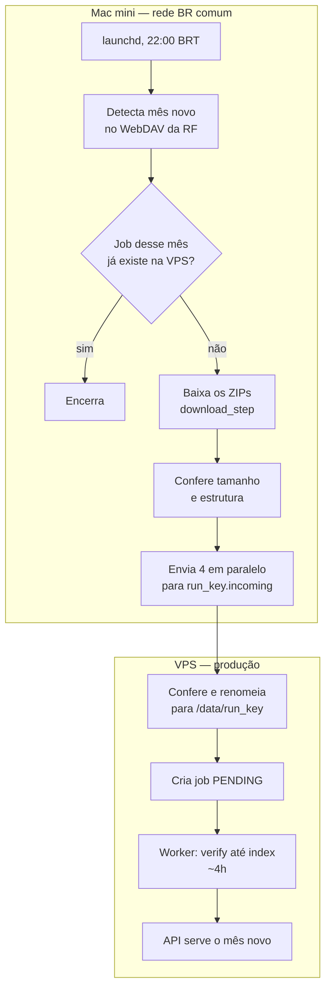

# Handoff — Coletor da Receita no Mac mini

17/09/2026

## Por que o Mac mini

Desde 11/09/2026 a VPS de produção não consegue mais baixar nada da Receita: `arquivos.receitafederal.gov.br` derruba toda conexão HTTPS vinda do IP dela. Uma conexão brasileira comum (a Algar do escritório) continua alcançando. Por isso o download sai da VPS e vai para um Mac mini numa rede brasileira; o processamento continua na VPS.

| Origem | Tipo de IP | HTTPS em `arquivos.receitafederal.gov.br` |
| --- | --- | --- |
| VPS Contabo `5.189.163.33` (França) | datacenter | reset logo depois do TLS |
| 17 nós estrangeiros do check-host.net | datacenter | reset |
| Nó brasileiro do check-host.net | datacenter | timeout |
| PC do escritório (Algar) | conexão comum BR | 200 na share, 207 no WebDAV |

O padrão aponta para bloqueio por tipo de IP (datacenter), não por país — mas um único ponto BR de datacenter não fecha a questão. Consequência prática: o Mac mini precisa sair por uma conexão comum brasileira, nunca por VPN ou proxy de datacenter.

## Estado atual

A carga de 2026-09 está no ar desde 16/09 às 04:35 BRT, feita à mão com o mesmo desenho que este handoff automatiza. A API serve `2026-09` com 73.359.616 linhas na matview. O que falta é tirar a mão do processo.

| Peça | Situação |
| --- | --- |
| Coletor no Mac mini | não existe — é o objeto deste handoff |
| `cnpj_scheduler` na VPS | no ar, mas falha a cada 30 min: não alcança a Receita |
| Job `2026-09` | SUCCESS na 1ª tentativa, 16/09 00:30 → 04:35 BRT |
| Fix do endpoint WebDAV (`/public.php/dav/files/<token>/`) | commit `b4f3f48`, deployado |
| `webdav.py` no `COPY` do Dockerfile + teste de guarda | commit `d681296`, deployado |

Como a carga de setembro foi feita: os 37 ZIPs (7,76 GB) foram baixados no PC do escritório em 37 min com o `download_step` de produção, enviados por `scp` para o volume da VPS, e um cron criou o job de madrugada. O worker viu os arquivos já presentes e pulou o download (0 min).

Sem o download, a VPS leva ~4h do job criado ao SUCCESS; o grosso é o `index` (2h13) e o `load` (59 min). Em agosto, o download feito na própria VPS somou mais 3h46.

Todo o código está na branch `nova`, que ainda não foi mergeada em `master`.

## Arquitetura alvo

O Mac mini só busca e entrega arquivos; a VPS continua dona de tudo que toca o banco. Uma vez por dia o Mac mini checa a Receita, e se houver mês novo baixa, confere, envia e cria o job — o worker da VPS faz o resto como fez em setembro.



O Mac mini dispara cada passo da VPS por SSH; nada roda de forma independente lá.

Regras do desenho:

- **Fonte da verdade é o `job_queue` da VPS.** "Já processei esse mês?" se responde por SSH, nunca com estado guardado no Mac mini.
- **O worker nunca pode ver arquivo pela metade.** O envio vai para `<run_key>.incoming/` e só vira `<run_key>/` depois de conferido — o `download_step` trata qualquer arquivo com tamanho maior que zero como pronto.
- **O Mac mini só apaga os ZIPs locais depois do job SUCCESS.** Se o processamento falhar, os arquivos ainda estão lá para reenviar.
- **O Mac mini nunca toca o Postgres.** Sem túnel, sem credencial do banco.

## Pré-requisitos do Mac mini

O requisito que decide tudo é a rede: se o Mac mini não receber 207 da Receita no teste da seção de validação, nada mais adianta. O resto é garantir que ele fique ligado e acordado sem ninguém olhar.

| Item | Requisito | Por quê |
| --- | --- | --- |
| Rede | Conexão brasileira comum, de preferência a do escritório; sem VPN nem proxy de saída | IPs de datacenter levam reset da Receita |
| Banda de subida | ~8 GB por mês | Do escritório: 0,85 MB/s por fluxo, ~3,5 MB/s com 4 fluxos (~40 min) |
| Energia e sono | `sudo pmset -a sleep 0 disksleep 0 autorestart 1` | Precisa estar acordado às 22h e voltar sozinho depois de queda de energia |
| FileVault | Desligado, ou aceitar login manual após todo reinício | Com FileVault ligado o Mac para na tela de desbloqueio e o launchd não roda |
| Disco livre | ≥ 20 GB | 7,76 GB por mês, mantidos até o job dar SUCCESS |
| Python | 3.12, igual ao container | Evita diferença de comportamento entre Mac e VPS |
| Dependências | `pydantic-settings`, `python-dotenv`, `httpx`, `tenacity` | Só isso é importado pelo caminho do download; o `requirements.txt` inteiro também funciona |
| rsync | O do Homebrew | O que vem no macOS recente é o openrsync, com menos opções; `--partial` precisa ser confiável |
| Chave SSH | Dedicada, ed25519, no `authorized_keys` do root da VPS | Envio para o volume e `docker exec` exigem root; chave própria = revogação sem afetar mais ninguém |
| Repo | Clone de `pedroxavier2244/Baixar_Ncpj`, branch `nova` | O fix do endpoint só existe lá |
| `WEBDAV_TOKEN` | O mesmo token de 15 caracteres do `.env` atual | Identifica o compartilhamento público da Receita |

O `config.py` lê o `.env` da raiz do repo. No Mac mini, mantenha nele só chaves que o `config.py` declara (`WEBDAV_TOKEN`, `DATA_DIR`, `CHECKPOINT_DIR`, `LOG_DIR`, `CONTROL_DB`); configuração própria do coletor, como host da VPS, fica fora dele.

## Implementação passo a passo

São três partes, nessa ordem: código novo no repo com deploy na VPS, montagem do Mac mini, e — só depois da primeira carga assistida dar certo — desligar o scheduler da VPS.

### A. Código no repo (branch `nova`)

1. **Modo sem rede no `enqueue_job.py`**, rodando dentro do `cnpj_worker`. Generaliza o script usado em setembro (`/root/criar_job_2026_09.py` na VPS).
    - `--status --run-key AAAA-MM` imprime JSON com o status do job daquele mês, ou `null` se não existir.
    - `--files-ready --run-key AAAA-MM` lê o `webdav_manifest_AAAA-MM.json` dos checkpoints, confere existência e tamanho de cada arquivo em `/data/AAAA-MM/` e só então cria o job. Sai com erro se algo divergir ou se já existir qualquer job para o mês; reprocessar um job DEAD fica manual.
    - Fica no `enqueue_job.py` de propósito: módulo novo na raiz obrigaria a mexer no `COPY` do Dockerfile.
2. **Coletor em `mac/coletor.py`**, fora da imagem Docker. Executa um passo por vez, loga cada um com horário e para no primeiro erro:
    1. `detect_wanted()` → mês e lista de ZIPs.
    2. Se o arquivo mais recente do mês foi modificado há menos de 2h, encerra: a Receita pode estar no meio da publicação (em setembro levou 10 min, de 14:58 a 15:08 GMT).
    3. SSH `--status`: SUCCESS → apaga os ZIPs locais desse mês e encerra; PENDING ou RUNNING → encerra; FAILED → encerra, porque o worker retenta sozinho até 3 vezes; DEAD (tentativas esgotadas) → encerra e loga alto, pedindo intervenção.
    4. `_save_manifest()` + `download_step.run()`, que retoma via `.part`.
    5. Confere local: tamanho contra o manifest, e `zipfile` abre cada ZIP.
    6. Envia para `<mes>.incoming/` no volume `cnpj_etl_data` com `rsync --partial`, um arquivo por processo, 4 em paralelo, com retentativa.
    7. SSH: confere os tamanhos em `.incoming`, faz `mv` para `<mes>/` e `chown -R 1001:1001`. Se `<mes>/` já existir, aborta.
    8. Copia o manifest para o volume `cnpj_etl_checkpoints`, dono `1001:1001`.
    9. SSH `--files-ready`.
    - Trava contra execução simultânea com `fcntl` — o macOS não traz `flock`.
    - Não usar `check_and_enqueue()`: ela criaria uma fila SQLite paralela no Mac mini.
3. **Testes** de `--status` e `--files-ready` no padrão de `tests/test_scheduler.py`: arquivo faltando, tamanho errado, job já existente, caminho feliz. Rodar também `tests/test_dockerfile_copy.py`.
4. **Deploy na VPS** do worker e do scheduler: `git rebase origin/nova`, depois `docker compose build worker scheduler`, depois `docker compose up -d --no-deps worker scheduler`. O porquê de cada detalhe está em Armadilhas.

### B. Mac mini

1. Fuso do sistema em `America/Sao_Paulo` — o launchd agenda pelo relógio local.
2. Clone do repo na branch `nova`, venv com Python 3.12, dependências, e o `.env` abaixo.
3. Chave SSH dedicada, alias `cnpj-vps` no `~/.ssh/config`, e a `.pub` colada em `/root/.ssh/authorized_keys` na VPS.
4. launchd como **LaunchDaemon**, que roda sem ninguém logado, em `/Library/LaunchDaemons/br.com.mbfinance.cnpj-coletor.plist`: `UserName` = dono do repo, `StartCalendarInterval` com `Hour` 22 e `Minute` 0, `ProgramArguments` = python do venv + `mac/coletor.py`, saídas em `~/cnpj/logs/`. Carregar com `sudo launchctl bootstrap system <plist>`.

`.env` do Mac mini:

```
WEBDAV_TOKEN=<token atual>
DATA_DIR=/Users/<usuario>/cnpj/data
CHECKPOINT_DIR=/Users/<usuario>/cnpj/checkpoints
LOG_DIR=/Users/<usuario>/cnpj/logs
CONTROL_DB=/Users/<usuario>/cnpj/pipeline_control.db
```

Chave e alias SSH:

```
ssh-keygen -t ed25519 -f ~/.ssh/cnpj_vps -C "mac-mini coletor cnpj"

# ~/.ssh/config
Host cnpj-vps
  HostName 5.189.163.33
  User root
  IdentityFile ~/.ssh/cnpj_vps
  IdentitiesOnly yes
  ServerAliveInterval 15
```

### C. VPS, depois da primeira carga assistida

1. Desligar o `cnpj_scheduler` com `SCHEDULER_ENABLED=false` em `/opt/cnpj/.env` e `docker compose up -d --no-deps scheduler`. Ele fica ocioso, logando `scheduler desabilitado`; ao contrário de `docker compose stop`, isso sobrevive a um `up` futuro.
2. Apagar de `/root` os scripts avulsos de setembro (`criar_job_2026_09.py`, `criar_job_2026_09.sh`, `conferir_2026_09.py`, `estrutura_2026_09.py`), substituídos pelo `--files-ready`.

## Validação go/no-go

O primeiro teste roda antes de escrever qualquer código: se o Mac mini não receber 207 da Receita, o plano inteiro para e a conversa volta para a causa do bloqueio.

Teste 1 — acesso à Receita, no Mac mini:

```
curl -s -o /dev/null -w '%{http_code}\n' --max-time 30 \
  -X PROPFIND -u "$WEBDAV_TOKEN:" -H 'Depth: 1' \
  "https://arquivos.receitafederal.gov.br/public.php/dav/files/$WEBDAV_TOKEN/"
```

| # | Teste | Passa se |
| --- | --- | --- |
| 1 | Acesso à Receita (comando acima) | Imprime `207`. `000`, reset ou timeout = no-go |
| 2 | SSH: `ssh cnpj-vps 'docker ps --format "{{.Names}}"'` | Lista `cnpj_worker` sem pedir senha |
| 3 | Velocidade: enviar `Empresas0.zip` (563 MB) em um fluxo | Próximo de 0,85 MB/s; bem abaixo disso, recalcular a janela das 22h |
| 4 | Ensaio com `2026-09`: baixa, confere, envia para `2026-09.incoming` e confere no servidor, sem renomear nem criar job | 37 de 37 arquivos batendo com o manifest no servidor; depois apagar `.incoming` |
| 5 | launchd: `sudo launchctl kickstart system/br.com.mbfinance.cnpj-coletor` | Log em `~/cnpj/logs/` mostra detecção e status `SUCCESS` de 2026-09, e encerra |
| 6 | Primeira carga real (outubro), acompanhada | Job criado, `/health` mostra `last_success_run_key` com o mês novo |

O ensaio do teste 4 é seguro porque 2026-09 já está SUCCESS: nada vai para `/data/2026-09/` e nenhum job é criado. Ele exige que o coletor tenha um modo `--ensaio` que pare antes do passo 7.

Só depois do teste 6 passar entra a parte C da implementação, que desliga o scheduler da VPS.

## Armadilhas conhecidas

Quase todas já aconteceram neste sistema; as quatro primeiras custaram tempo na carga de setembro.

| Armadilha | O que acontece | Como evitar |
| --- | --- | --- |
| Arquivo truncado conta como pronto | O `download_step` pula qualquer arquivo com tamanho maior que zero. Envio interrompido deixa meio arquivo que o worker aceita e o `verify_step` só barra horas depois | Enviar para `.incoming` e conferir tamanho antes do `mv` |
| Contador próprio em vez do manifest | O envio de setembro encerrou sem `Empresas4.zip`: duas duplicatas inflaram a contagem de linhas até 37 | Conferir sempre nome e tamanho contra o manifest |
| `COPY` explícito no Dockerfile | Módulo novo na raiz some da imagem; o `cnpj_scheduler` entrou em crash-loop em 15/09 | `tests/test_dockerfile_copy.py`; lógica nova da VPS dentro do `enqueue_job.py` |
| Conexão cai no meio do envio | `Connection reset by peer` numa das tentativas de 15/09 | `rsync --partial` com retentativa |
| Um fluxo só é lento | ~0,85 MB/s por conexão até a França (latência ~200 ms); o link não é o limite | 4 fluxos em paralelo, ~3,5 MB/s |
| `docker compose up` na VPS | Sem nome de serviço recria o worker e interrompe carga em andamento. Com nome mas sem `--no-deps`, esbarra no nome do redis (`88ab8fd17ca0_cnpj_redis`) e deixa container órfão | `build` separado, depois `up -d --no-deps <serviços>` |
| `git pull` na VPS | `/opt/cnpj` tem um commit local do `nginx.conf` nunca pushado; o pull diverge | `git fetch` + `git rebase origin/nova` |
| Script fora de `/app` no container | `python /tmp/x.py` não acha `config`: o Python põe a pasta do script no path | `docker exec -w /app -e PYTHONPATH=/app`, ou rodar o `enqueue_job.py` de `/app` |
| Crontab do root na VPS | Tem jobs de produção de outros sistemas (mb-crm, abertura-sync, mb-resultado) | Não agendar nada deste fluxo lá; se precisar mexer, backup e conferir a contagem de linhas |
| Fusos | VPS em `Europe/Berlin`: 5h à frente de São Paulo hoje, 4h a partir de 25/10 | Agendar só no Mac mini, em horário de São Paulo |
| Script antigo com endpoint morto | `baixar_cnpj_webdav.py` na raiz ainda usa `/public.php/webdav/` | Não reaproveitar; usar `webdav.py` |

## Decisões em aberto

Nenhuma bloqueia o início; as duas primeiras precisam estar decididas antes da primeira carga real.

| Decisão | Opções | Recomendação |
| --- | --- | --- |
| FileVault no Mac mini | Ligado: disco cifrado, mas após queda de energia alguém precisa logar. Desligado: volta sozinho, mas a chave SSH de root da VPS fica num disco sem cifra | Depende de onde o Mac mini fica fisicamente — a chave dá root na produção |
| Aviso de falha | Hoje a regra é só log, sem notificação. Com o Mac mini no caminho, máquina desligada ou sem rede passa em silêncio até alguém notar dado velho | Mac mini grava um batimento na VPS a cada execução; um vigia na VPS avisa se passar de 48h sem batimento |
| Horário do coletor | 22h: envio termina ~23:30 e a VPS fecha ~03:30. 03h (horário do scheduler atual): fecha ~08:30 e cruza o job `socio_empresas` das 04h | 22h |
| Acesso SSH | Root com chave dedicada; usuário próprio no grupo `docker` (na prática equivale a root); comando forçado no `authorized_keys` limitando a rsync e `enqueue_job.py` | Root com chave dedicada agora; comando forçado se o Mac mini ficar em local pouco controlado |
| Scheduler da VPS | Desligar; ou manter ligado para o caso de a Receita liberar o IP | Desligar: ligado, ele falha a cada 30 min, e se a Receita liberar ele disputa o mesmo mês com o Mac mini |
| Causa do bloqueio (causa B) | Seguir só com o Mac mini; ou testar um IP de datacenter brasileiro limpo | Testar: se passar, um proxy barato devolve a autonomia à VPS. Dá para testar com uma edge function descartável num dos dois projetos Supabase em `sa-east-1` |

## Referências

Caminhos e comandos citados acima, num lugar só. O código está na branch `nova` depois dos commits `b4f3f48` e `d681296`.

| Onde | Caminho | Para quê |
| --- | --- | --- |
| Repo | `webdav.py` | Base e prefixo do endpoint `dav/files` |
| Repo | `enqueue_job.py` | `detect_wanted()`, `_save_manifest()`, `propfind_listing()`; recebe os modos `--status` e `--files-ready` |
| Repo | `steps/download_step.py` | Download com resume via `.part`; 300 s de timeout, 5 retentativas |
| Repo | `steps/verify_step.py` | CRC de cada membro do ZIP + SHA256 — a checagem real do transporte |
| Repo | `db/control.py` | Fila `job_queue`; status `PENDING`, `RUNNING`, `SUCCESS`, `FAILED` (retentado até 3 vezes), `DEAD` |
| Repo | `config.py` | `wanted_files` com os 10 prefixos de arquivo baixados |
| Repo | `tests/test_webdav_endpoint.py`, `tests/test_dockerfile_copy.py` | Guardas do endpoint e do `COPY` do Dockerfile |
| VPS | `/opt/cnpj` | Deploy (projeto compose `cnpj`), com `.env` próprio |
| VPS | `/var/lib/docker/volumes/cnpj_etl_data/_data` | `/data` nos containers: um diretório por mês |
| VPS | `/var/lib/docker/volumes/cnpj_etl_checkpoints/_data` | `/checkpoints`: `pipeline_control.db` e `webdav_manifest_<mes>.json` |
| VPS | `cnpj_worker`, workdir `/app` | Roda o pipeline como `appuser`, uid e gid 1001 |
| VPS | `curl http://localhost:8001/health` | `last_success_run_key` e `mv_row_count` confirmam a carga |
| VPS | `/var/log/cnpj_job_2026_09.log` | Log da criação do job de setembro |
| VPS | `/root/crontab.bak.20260915-174415` | Backup do crontab antes da carga de setembro |
| Receita | `https://arquivos.receitafederal.gov.br/public.php/dav/files/<token>/` | Uma pasta `AAAA-MM/` por mês, 37 ZIPs (7,76 GB em 2026-09) |
| Receita | `https://arquivos.receitafederal.gov.br/public.php/webdav/` | Endpoint legado, morto desde 11/09/2026 |
